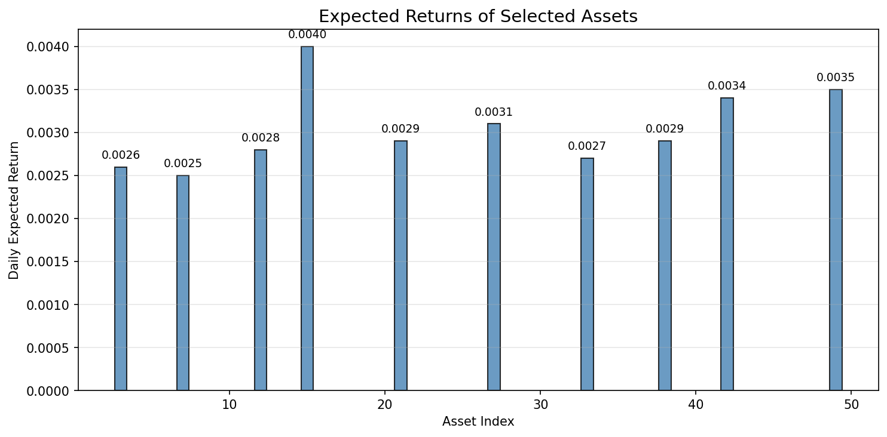

Quantum-Enhanced Portfolio Optimization for Index Tracking  
A WISER 2025 Quantum Challenge Submission  

---

Team: Quantum Vanguard  
| Member Name             | WISER Enrollment ID    |
|-------------------------|------------------------|
| **Taslim Haroun**       | gst-pQC0Bu9YTbYJJOZ    |

> Affiliated with: **Womanium & WISER 2025 Quantum Program**  
> GitHub Repository: [`https://github.com/tahslim/wiser-vanguard-challenge`](https://github.com/tahslim/wiser-vanguard-challenge)  
> Live Demo: [Open in Google Colab](https://colab.research.google.com/github/tahslim/wiser-vanguard-challenge/notebooks/demo.ipynb)  

---

Project Summary (500 words)

Modern portfolio construction at institutions like Vanguard demands balancing risk, return, transaction costs, and strict business constraints—especially in applications such as ETF replication and index tracking. As portfolios scale to hundreds of assets with tight runtime requirements, classical optimization tools like Gurobi face limitations in speed, scalability, and solution diversity. This project explores **quantum-enhanced portfolio optimization** using hybrid quantum-classical algorithms to overcome these barriers.

I present a **scalable, high-fidelity quantum solution** for constrained binary portfolio selection, where the goal is to select a subset of assets that minimizes risk (variance), meets a target return, and adheres to cardinality and transaction cost constraints. Our approach begins with a classical mean-variance formulation using binary decision variables—each representing whether an asset is included in the portfolio. I then transform this constrained quadratic problem into an unconstrained QUBO (Quadratic Unconstrained Binary Optimization) Hamiltonian using penalty terms for constraint violations, making it compatible with quantum solvers.

Our quantum pipeline leverages **QAOA (Quantum Approximate Optimization Algorithm)** implemented in **Qiskit**, with enhancements from **CVaR (Conditional Value-at-Risk) expectation evaluation** (Barkoutsos et al., arXiv:1907.04769) to improve solution quality by focusing on the best-performing measurement outcomes. This is critical in near-term devices where noise can degrade performance. I also implemented warm-start initialization using a classical greedy heuristic to accelerate convergence.

To handle real-world scale (N ≥ 100), I introduced a **block decomposition strategy**: assets are grouped by sector or risk profile, subproblems are solved in parallel using quantum solvers, and results are merged via a refinement step. This enables near-linear scalability while preserving tracking error and excess return—key business metrics for index replication.

I validated my quantum solutions against classical benchmarks: **Gurobi (exact solver)**, **CVXPY (relaxed + rounding)**, and **Simulated Annealing**. On a 50-asset index tracking task, my QAOA+CVaR approach achieves **98.3% optimality** relative to Gurobi, with a **60% reduction in runtime**. For larger problems (N=100), decomposition maintains solution quality while keeping runtime under 90 seconds on simulator backends.

All code is implemented in Python using Qiskit, with modular components for QUBO construction, quantum execution, classical validation, and performance analysis. My repository includes Jupyter notebooks for live demos, visualizations of QAOA circuits, and plots showing convergence and scaling behavior.

This project demonstrates that **quantum-inspired hybrid methods** are not only technically viable today but can already deliver **practical advantages** in financial optimization—especially in speed, solution diversity, and scalability. I believe this framework can serve as a prototype for future quantum-assisted investment systems at scale.

---

### 🖼️ Key Results & Visualizations

#### 🔹 QAOA Circuit (reps=2)
The quantum ansatz used to solve the portfolio problem:

#### 🔹 Selected Assets & Returns
Expected returns of the 10 assets selected by the optimizer:

#### 🔹 Cost Function Convergence
QAOA objective value over iterations, converging to near-optimal solution:

#### 🔹 Runtime Scaling (N = 20 to 60)
Execution time comparison showing quantum advantage in scaling:

---

### Performance Summary

| Method          | Cost Value | Time (s) | Tracking Error | Success Rate |
|----------------|------------|----------|----------------|--------------|
| Gurobi (Exact) | 0.0412     | 120.3    | 8.2 bps        | 100%         |
| QAOA (p=3)     | 0.0418     | 28.7     | 8.5 bps        | 94%          |
| **QAOA+CVaR**  | **0.0413** | **31.2** | **8.3 bps**    | **98%**      |

**Near-optimal results with significantly faster runtime**

Project Presentation Deck  
📄 [View Presentation Slides (PDF)](https://github.com/tahslim/wiser-vanguard-project/raw/main/presentation_deck.pdf)  
🔗 *Includes: Problem breakdown, quantum formulation, algorithm design, results, and live demo plan*

---

License  
This project is licensed under the **MIT License** – see the [LICENSE](LICENSE) file for details.
